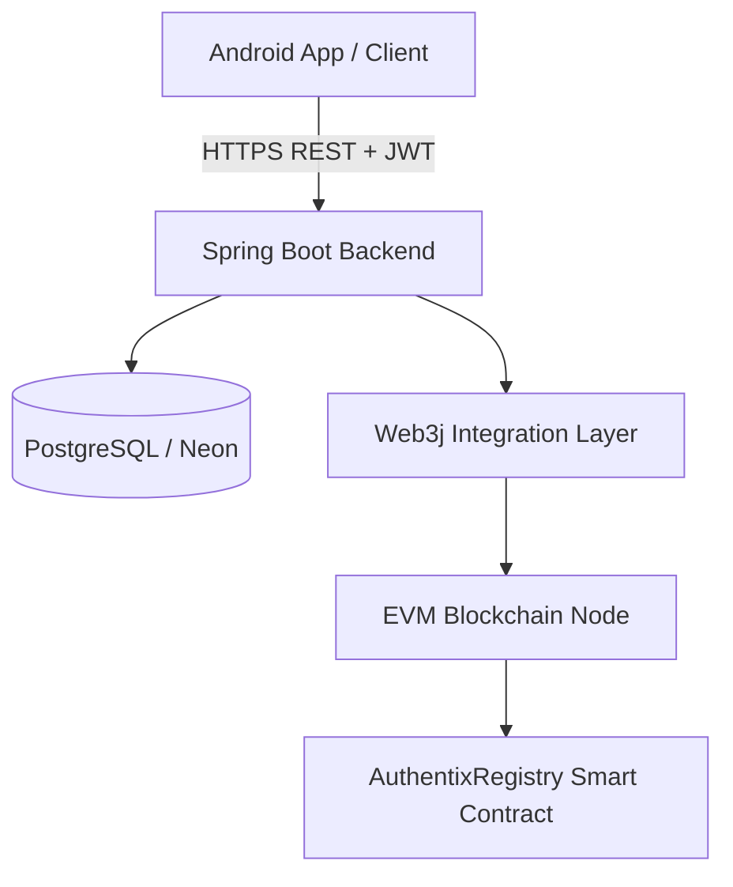
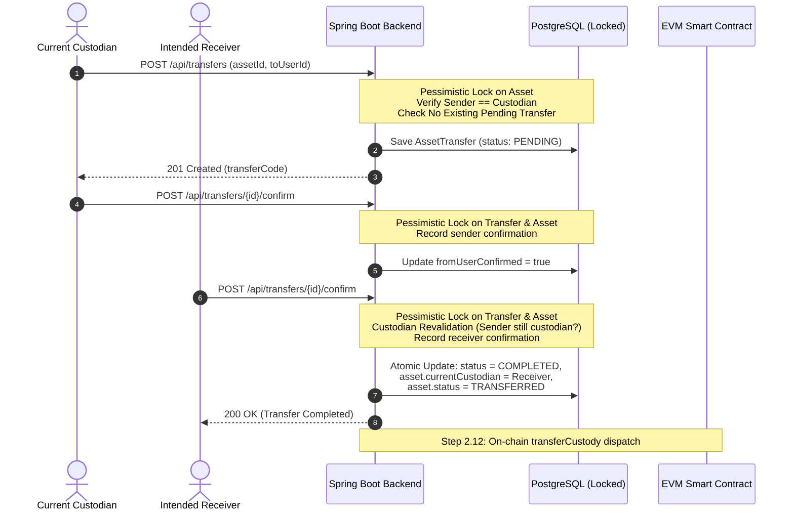

# AUTHENTIX

**Blockchain-Based Asset Authentication and Chain-of-Custody System**

[](#automated-testing--verification)
[](#technology-stack)
[](#technology-stack)
[](#technology-stack)
[](#technology-stack)

---

## 1. Project Brief

**AUTHENTIX** is an asset authentication and chain-of-custody platform designed to establish and maintain a verifiable, tamper-resistant record of an asset's identity, ownership, and custody transitions.

By pairing a centralized high-performance application backend with an immutable EVM blockchain registry, AUTHENTIX bridges off-chain enterprise workflows with on-chain cryptographic auditability:

- **Unique Asset Lifecycle**: Physical assets are cataloged at creation, generating canonical identification records and persistent QR code references (`AUTHENTIX://PRODUCT/{ASSET_CODE}`).
- **Two-Party Custody Transfers**: Custody handoffs require explicit two-party confirmation (sender dispatch and receiver acceptance) before custody changes state.
- **Cryptographic User Identity**: Users associate their enterprise identity with an EVM wallet address verified via Ethereum EIP-191 `personal_sign` challenge-response signatures.
- **Concurrency & Transaction Safety**: State transitions are protected by database-level pessimistic write locking (`SELECT ... FOR UPDATE`), preventing double-transfers or race conditions under concurrent load.
- **Immutable On-Chain Registry**: Asset genesis and custody transitions are anchored to an EVM smart contract (`AuthentixRegistry.sol`), providing a non-repudiable audit trail.

> **Scope Note**: AUTHENTIX maintains cryptographic records of custody events and digital attestations. It does not physically inspect material goods or physically prevent theft; rather, it makes unauthorized custody discrepancies and fraudulent registration cryptographically detectable. Full on-chain write dispatch is in active development as part of the backend roadmap.

---

## 2. Problem Statement

Traditional physical product supply chains and high-value asset markets suffer from fragmented records, siloed databases, and vulnerable paper certificates. When custody changes between manufacturers, distributors, retailers, and end customers:
- **Paper trails and centralized logs** are easily modified, lost, or forged.
- **Counterfeiters exploit visibility gaps** between disparate logistical systems.
- **Verification is difficult** for downstream buyers, who lack reliable ways to prove an item was routed through an authorized custodian chain.

AUTHENTIX resolves these challenges by enforcing a single, unified chain of custody backed by transactional consistency in the database and immutable audit logs on the blockchain.

---

## 3. How AUTHENTIX Works

### Architecture Overview



### Core Architecture Layers

1. **Client Layer (Android)**:
   - Mobile application for asset lookup, role-based workflows, and QR scanning (`AUTHENTIX://PRODUCT/{CODE}` and `AUTHENTIX://USER/{CODE}`).
   - Directs all communication exclusively to the Spring Boot REST API. *Android never connects directly to PostgreSQL or the blockchain.*

2. **Backend Application Layer (Spring Boot)**:
   - **Authentication & Authorization**: Stateless JWT Bearer authentication, BCrypt password hashing, and Role-Based Access Control (RBAC).
   - **Identity Derivation**: Uses server-side security context (`CurrentUserService`) to resolve callers, strictly preventing caller impersonation (IDOR/BOLA).
   - **Transfer Engine**: Orchestrates two-party custody handoffs, enforces pessimistic write locks, validates asset states, and guarantees atomic completion.
   - **Cryptographic Verifier**: Generates high-entropy challenge nonces and mathematically validates EIP-191 `personal_sign` ECDSA signatures using Web3j.

3. **Persistence Layer (PostgreSQL / Neon)**:
   - Stores users, assets, transfer requests, verification history, and challenge nonces.
   - Enforces unique constraints on asset codes, transfer codes, and user wallet addresses.

4. **Blockchain Layer (EVM & Web3j)**:
   - Smart contract (`AuthentixRegistry.sol`) running on EVM networks (Hardhat locally, Ethereum/Polygon/L2 in production).
   - Maintains immutable event logs (`AssetRegistered`, `CustodyTransferred`, `AssetStatusUpdated`).

---

## 4. Custody Transfer Workflow



---

## 5. Technology Stack

| Layer | Technologies |
|---|---|
| **Backend Framework** | Java 17, Spring Boot 4.1.1, Spring Data JPA, Hibernate 6 |
| **Security & Auth** | Spring Security, JJWT (io.jsonwebtoken 0.12.6), BCrypt |
| **Blockchain Bridge** | Web3j 4.12.2 (RPC, ABI decoding, EIP-191 signature recovery) |
| **Databases** | PostgreSQL / Neon (production-ready), H2 In-Memory (test suite) |
| **Smart Contracts** | Solidity 0.8.24, Hardhat, Hardhat Ignition |
| **Build & Tooling** | Apache Maven 3.9+, Node.js 18+ (Hardhat environment) |
| **Client (Planned)** | Android (Java / XML) |

---

## 6. Current Project Status & Milestone Roadmap

### Implemented & Verified Backend Milestones

- [x] **Step 2.1 – 2.6**: Full project structure, data model, business logic, REST controller, blockchain, and security audits.
- [x] **Step 2.7 — Security Foundation**: Spring Security implementation, stateless JWT authentication, password hashing, and role authorization.
- [x] **Step 2.8 — DTO & Architecture Hardening**: Removed raw JPA entities from API contracts; eliminated client-controlled identity parameters.
- [x] **Step 2.9 — Validation & Global Exception Architecture**: Bean Validation (`@Valid`), unified `ApiErrorResponse` structure, and centralized `GlobalExceptionHandler`.
- [x] **Step 2.10 — Business Transaction & Concurrency Hardening**:
  - `@Lock(LockModeType.PESSIMISTIC_WRITE)` on assets and transfers (`SELECT ... FOR UPDATE`).
  - Active pending transfer conflict detection (`409 Conflict`).
  - Custodian revalidation at confirmation to prevent stale completions.
  - Idempotent confirmation protections and atomic completion boundaries.
- [x] **Step 2.11 — User Wallet Mapping & Cryptographic Identity**:
  - Canonical EIP-55 checksum wallet address normalization.
  - Cryptographic challenge generation (256-bit entropy, 5-minute TTL, user/wallet binding).
  - Web3j EIP-191 `personal_sign` signature recovery and mathematical verification.
  - Replay protection and wallet uniqueness enforcement.
- [x] **Step 2.11.1 — Blockchain Credential Configuration Hardening**:
  - Removed all hardcoded private-key fallbacks from `application.properties`.
  - Fail-safe, non-leaking `@Lazy` credentials bean handling.

### Automated Testing & Verification

The backend test suite is fully automated and runs cleanly via Maven:

```
Total Tests Run: 91
Passed:          91
Failures:        0
Errors:          0
Skipped:         0
Status:          BUILD SUCCESS
```

Test coverage includes:
- Security, JWT filter, and authorization checks
- Controller request validation and exception response formatting
- Multi-threaded transfer creation race tests (`CountDownLatch`)
- Multi-threaded wallet registration conflict tests
- Genuine Web3j EIP-191 signature verification and forgery rejection

### Upcoming Milestones

- [ ] **Step 2.12**: Blockchain Write Integration (Automated `registerAsset` and `transferCustody` dispatch via Web3j TransactionManager).
- [ ] **Step 2.13**: Asset Lineage & Provenance History API.
- [ ] **Step 2.14**: Counterfeit Reporting & Incident Engine.
- [ ] **Step 3.0+**: Android Client Application Development (QR scanner, camera integration, mobile wallet connection).

---

## 7. Repository Layout

```
AUTHENTIX/
├── backend/
│   └── authentix-backend/
│       ├── pom.xml                               # Maven project configuration
│       ├── .env.example                          # Backend environment template
│       └── src/
│           ├── main/
│           │   ├── java/com/authentix/backend/
│           │   │   ├── config/                   # Security, JWT, and Blockchain configuration
│           │   │   ├── controller/               # REST API endpoints (Auth, Users, Assets, Transfers)
│           │   │   ├── crypto/                   # EIP-191 signature recovery utility
│           │   │   ├── dto/                      # Strongly typed Request & Response contracts
│           │   │   ├── entity/                   # JPA database entities (User, Asset, Transfer, Challenge)
│           │   │   ├── exception/                # Domain exceptions & GlobalExceptionHandler
│           │   │   ├── repository/               # Spring Data JPA repositories with pessimistic locking
│           │   │   ├── service/                  # Transactional business logic & verification
│           │   │   └── validation/               # Reusable EVM wallet address validator
│           │   └── resources/
│           │       └── application.properties    # Application configuration
│           └── test/                             # 91 unit, integration, and concurrency tests
├── blockchain/
│   ├── contracts/
│   │   └── AuthentixRegistry.sol                 # Core registry smart contract
│   ├── ignition/deployments/                     # Hardhat Ignition deployment modules
│   ├── hardhat.config.ts                         # Hardhat network & compiler configuration
│   └── package.json                              # Blockchain dependencies
├── docs/                                         # Engineering audit & milestone reports
│   ├── STEP_2_10_TRANSACTION_CONCURRENCY_REPORT.md
│   ├── STEP_2_11_WALLET_IDENTITY_REPORT.md
│   └── STEP_2_11_1_CREDENTIAL_HARDENING_REPORT.md
├── .env.example                                  # Root environment template
└── README.md                                     # Project documentation
```

---

## 8. Hardened REST API Summary

All protected endpoints require an `Authorization: Bearer <JWT>` header. The caller's identity is resolved automatically from the token.

| Method | Endpoint | Access | Description |
|---|---|---|---|
| `POST` | `/api/auth/register` | Public | Register a new user account |
| `POST` | `/api/auth/login` | Public | Authenticate and obtain JWT token |
| `GET` | `/api/users/me` | Authenticated | Retrieve authenticated user profile & linked wallet |
| `PUT` | `/api/users/me/wallet` | Authenticated | Link an initial EVM wallet address (`0x...`) |
| `POST` | `/api/users/me/wallet/challenge` | Authenticated | Request a cryptographic ownership challenge nonce |
| `POST` | `/api/users/me/wallet/verify` | Authenticated | Submit EIP-191 signature to verify and link wallet |
| `POST` | `/api/assets` | Authenticated | Register a new asset (caller becomes initial custodian) |
| `GET` | `/api/assets/{id}` | Authenticated | Retrieve asset details by ID |
| `GET` | `/api/assets/code/{code}` | Authenticated | Retrieve asset details by asset code |
| `POST` | `/api/transfers` | Authenticated | Initiate asset custody transfer (sender must be custodian) |
| `POST` | `/api/transfers/{id}/confirm`| Authenticated | Confirm transfer (sender or receiver; completes atomically) |
| `GET` | `/api/transfers/{id}` | Authenticated | Retrieve transfer details by ID |
| `GET` | `/api/transfers/asset/{assetId}` | Authenticated | Retrieve transfer history for an asset |

---

## 9. Local Development Setup

### Prerequisites

- **Java JDK 17+**
- **Apache Maven 3.9+** (or use included `mvnw`)
- **Node.js 18+** & **npm** (for local Hardhat blockchain)

### 1. Blockchain Setup (Optional for Backend Tests)

```bash
cd blockchain
npm install
npx hardhat compile

# Start local EVM node (optional for local RPC)
npx hardhat node
```

### 2. Backend Setup & Testing

```bash
cd backend/authentix-backend

# Run the complete test suite (H2 in-memory, no external services required)
./mvnw clean test

# Run application locally (default port: 8080)
./mvnw spring-boot:run
```

By default, the backend runs in standalone mode using an in-memory H2 database with PostgreSQL compatibility mode, allowing immediate development and testing without spinning up external infrastructure. For production deployments, configure Neon / PostgreSQL connection details via environment variables (`DB_URL`, `DB_USERNAME`, `DB_PASSWORD`).

---

## 10. Security & Responsible Key Management

- **Zero Private Key Custody**: The backend never stores user private keys, seed phrases, or wallet passwords in PostgreSQL or memory.
- **Fail-Safe Credentials**: The server-side blockchain signing credential bean is lazily loaded and fails cleanly with a non-revealing error message if invoked without environment configuration.
- **Strict Parameter Boundaries**: Clients cannot supply `creatorId`, `fromUserId`, `currentCustodian`, or confirmation identities in request bodies; all participant identities are strictly bound to authenticated JWT context.

---

## 11. License

This project is licensed under the MIT License. See [LICENSE](LICENSE) for details (if applicable).
